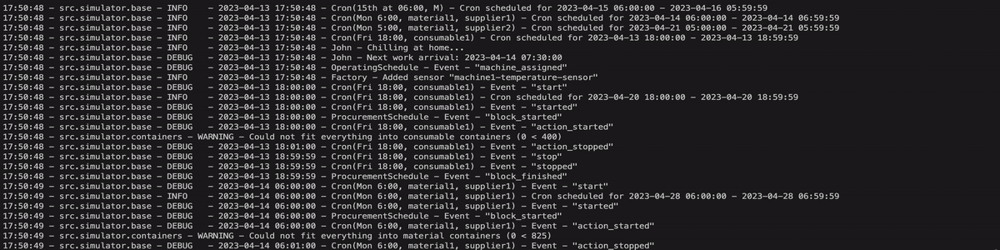
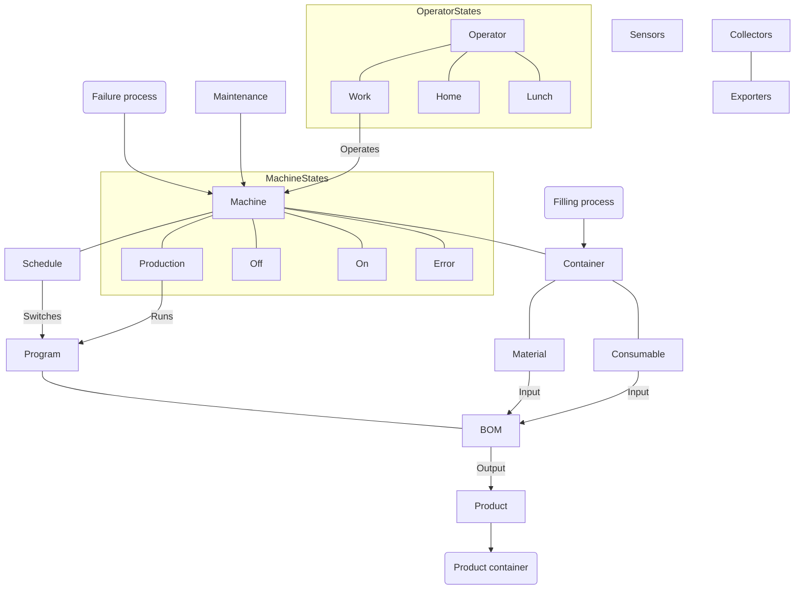

# :factory: Factory Simulator

Factory floor simulator written in Python using [simpy](https://simpy.readthedocs.io). The simulator can be used as-is for a simple OPC-UA demo server in a container, or as a basis for more complex real factory floor simulation. See example simulation output for a 7-day simulation [here](./docs/categorical-results.png) and [here](./docs/numerical-results.png).



:exclamation: I have no plans on creating a package out of this hobby project, but hopefully you find it useful :v:

## Installation

You have two options:

- Run simulation as an OPC-UA server with limited customization possibilities - see instructions [here](./src/server/README.md).

- Run within Python with full customization possibilities - clone and install dependencies as follows:

  ```shell
  git clone https://github.com/jmyrberg/factory-simulator && \
  cd factory-simulator && \
  pip install requirements.txt
  ```

  After this, see [getting started](#getting-started).

## Getting started

The default configuration in [factory.yml](./config/factory.yml) will showcase a simple example to get you started:

```python
import logging
import sys

from src.simulator.factory import Factory


logging.basicConfig(
    stream=sys.stdout,
    level=logging.INFO,
    format="%(asctime)s - %(name)s - %(levelname)-7s - %(message)s",
    datefmt="%H:%M:%S",
)
logger = logging.getLogger(__name__)


logger.info('Starting simulation')
factory = Factory.from_config('config/factory.yml')
factory.run(7)
factory.data_df
# factory.plot()  # Set monitor=-1 in config for this to be meaningful
```

Please also see [main.py](main.py) and [factory-simulator -notebook](./notebooks/factory-simulator.ipynb) for reference.

It is recommended to start with this basic config and work your way towards your end goal from there. Depending on your goal, you may need to modify parts of the code itself, as the YAML-configuration has only limited number of settings that can be changed.

## Architecture

The following describes the main components and states of a factory.



Components:

- **Machine**s produce **Product**s from discrete **Material**s and continuous **Consumable**s as defined by **Bill of Material**s (BOM)
- **Operator**s may be at home, work or having lunch, and are responsible for operating machines and fixing simple errors
- **Container**s store all materials, consumables and end products
- **Schedule**s define the production programs that are run and raw material procurement
- **Maintenance** team fix more challenging machine errors
- **Sensor**s measure quantities or states from processes
- **Collector**s define data to collect from the simulation, whereas **Exporter**s write that data for later use

Other noteworthy features and processes:

- Machine may heat up too much and parts may break, causing the machine to go in error state
- Machine is maintained based on a schedule
- Different programs may produce different products and consume different (amounts of) materials and consumables, and they may have different temperature profiles
- Raw material and consumable procurement may fail, and they have quality that affects end product quality
- Randomization is implemented by default in many operations and can be toggled on or off
- Collector enables very flexible automatic data collection from Python object attributes

---

Jesse Myrberg (jesse.myrberg@gmail.com)
