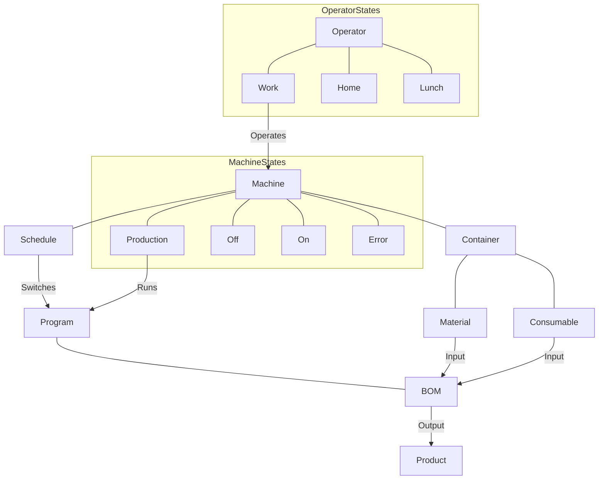

# Factory Simulator

Code for simulating a factory floor.

## Architecture

```mermaid
  graph TD;
    Container---Material
    Container---Consumable
    Machine---Schedule
    Schedule-- Switches -->Program
    Machine---Container
    Program---BOM
    Production-- Runs -->Program
    Material-- Input -->BOM
    Consumable-- Input -->BOM
    BOM-- Output -->Product
    Work-- Operates -->Machine
    subgraph MachineStates
      Machine---Off
      Machine---On
      Machine---Error
      Machine---Production
    end
    subgraph OperatorStates
      Operator---Home
      Operator---Work
      Operator---Lunch
    end
```
