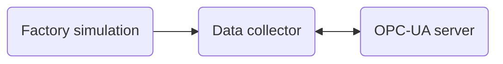

# Factory Simulator - OPC UA Server and Client

Provide simulator data as an OPC UA server.

## Deployment

Build

```shell
docker build . -t factory-simulator -f src/app/Dockerfile
```

Run

```shell
docker run -p 4840:4840 --env-file .env -v $(pwd):/opt/app factory-simulator
```

## Architecture


