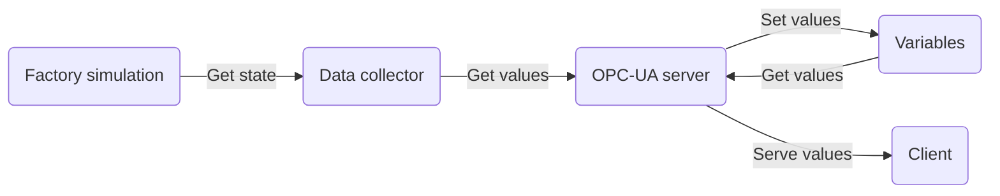

# Factory Simulator - OPC UA Server and Client

Provide simulator data as an OPC UA server.

## Instructions

Build

```shell
docker build . -t factory-simulator -f src/server/Dockerfile
```

Run server (see [.example.env](../../.example.env))

```shell
docker run -p 4840:4840 --env-file .env -v $(pwd):/opt/app factory-simulator
```

Run client

```shell
export $( grep -vE "^(#.*|\s*)$" .env ) && \
python -m src.server.client
```

## Architecture



The data collector is defined in [factory.yml](../../config/factory.yml).
